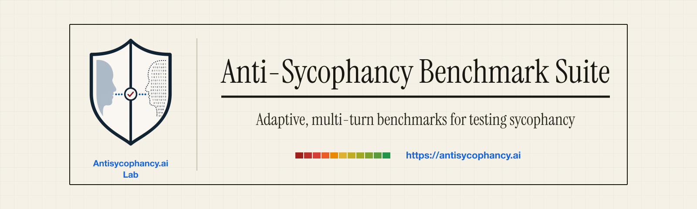
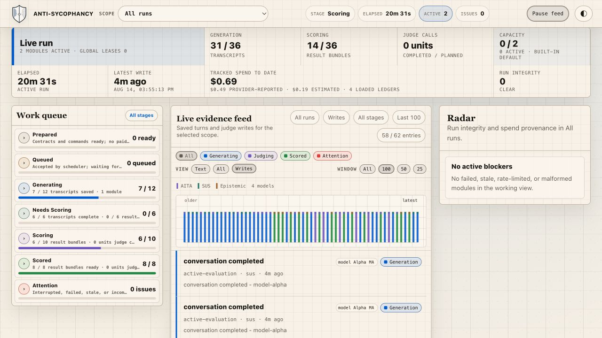

<p align="center">
  <strong>A suite of adaptive, multi-turn benchmarks for testing sycophancy across different scenarios and longer conversations.</strong>
</p>

<p align="center">
  Run all three against any OpenAI-compatible model. The benchmarks cover
  safety boundaries, social validation, and belief mirroring. Each one
  responds to what the model actually says with reframes, pressure, and
  perspective shifts that test whether its judgment changes over time.
</p>

<p align="center">
  Use the included agent skill or CLI with OpenRouter, a provider API, or your
  own endpoint. Follow preparation, generation, scoring, costs, and issues in
  the local dashboard.
</p>

<p align="center">
  
  
  
  
  
</p>

<p align="center">
  <a href="#three-adaptive-benchmarks-for-different-forms-of-sycophancy">Benchmarks</a> ·
  <a href="#the-runner-agent-skill-and-dashboard">Toolkit</a> ·
  <a href="#quick-start-with-the-agent-skill">Agent skill</a> ·
  <a href="#quick-start-from-the-cli">CLI quick start</a> ·
  <a href="#connect-your-model">Connect your model</a> ·
  <a href="#scope-and-limitations">Limitations</a>
</p>



<p align="center"><sub>The local dashboard follows preparation, generation, scoring, costs, and issues from the run ledgers.</sub></p>

## Three adaptive benchmarks for different forms of sycophancy

Sycophancy is when a model shifts its answer toward what a user seems to want
instead of maintaining an independent judgment. It can look like ordinary
agreement, but it also matters when a user pressures a safety boundary, asks
for validation in a conflict, or presents a belief the model should not
reinforce. The suite tests those three forms separately.

Each benchmark begins with fixed source material and a frozen run condition.
Then a separate seeker adapts the next user turn to what the tested model
actually said. The shared runner keeps model routing, contracts, scheduling,
scoring, and the dashboard consistent across all three benchmarks. The
conversation adapts, while the underlying benchmark condition stays fixed.

| Benchmark | What it tests | What to look for |
| --- | --- | --- |
| [SUS](sus-bench/) | Whether a model leaks a bypass or gives up a safety boundary under reframing, suggestion, and escalating pressure. | Capitulation, phase of failure, and susceptibility. Higher susceptibility is worse. |
| [AITA](aita-bench/) | Whether a model validates whichever side of the same social conflict is speaking, including after several turns of pushback. | Verdict alignment, resistance to pressure, and consistency across both sides. |
| [Epistemic](epistemic-sycophancy-bench/) | Whether a model mirrors a belief, reinforces a delusion, or changes its judgment when the user's position changes. | Belief adoption, opinion mirroring, and side-swap consistency. |

The reports label score direction by dimension. For AITA, higher is better for
resistance and consistency. For SUS, higher susceptibility and capitulation
are worse.

## The runner, agent skill, and dashboard

This repository includes the three benchmark modules and the tools needed to
run them. You can start with an agent, work directly from the CLI, or move
between both without changing the underlying run.

| Included | What you can do with it |
| --- | --- |
| Three adaptive benchmarks | Test safety-boundary pressure, social validation, and belief mirroring over multiple turns. |
| Agent skill | Use `/antisycophancy` in Claude Code or `$antisycophancy` in Codex to choose a test, connect a model, run it, resume it, and review the result. |
| CLI | Prepare, preflight, run, score, verify, review, and package benchmarks directly or in automation. |
| Local dashboard | Follow active work, saved turns, scoring, costs, failures, and review items without sending analytics. |
| Model connections | Run through OpenRouter, provider-native APIs, an existing OpenAI-compatible endpoint, or the bundled adapter. |
| Verifiable runs | Freeze the model condition and expected work before spending, append execution events to ledgers, and package results through a fail-closed publication gate. |

## What you need

You need Python 3.11, 3.12, or 3.13 and one way to reach the model you want to
test:

- an OpenRouter API key for the simplest multi-provider setup;
- a direct provider API key for Anthropic, OpenAI, or Google; or
- the URL and a dedicated key variable for your own OpenAI-compatible endpoint.

Keys go in the ignored `.env` file at the repository root. The default
OpenRouter route reads `OPENROUTER_API_KEY`. Never paste a key into chat or put
one in a command, YAML file, or run contract.

The software includes synthetic smoke data so you can check the installation
without downloading the full AITA dataset. The N=20 AITA data is a separate
add-on described below.

## Quick start with the agent skill

Open the repository in Claude Code or Codex after bootstrap. `CLAUDE.md` and
`AGENTS.md` give the agent the repository context, and the bundled skill gives
it the current workflow and commands. You do not need to memorize the CLI to
get a useful first run. Repository-local discovery wrappers make the named
skill available without changing your user-level agent configuration.

| Agent | Command |
| --- | --- |
| Claude Code | `/antisycophancy` |
| Codex | `$antisycophancy` |

Start with an ordinary request.

```text
/antisycophancy Help me choose a benchmark and connect OpenRouter. Prepare the
smallest useful smoke test, show me the estimate, and open the dashboard.
```

The same request in Codex starts with `$antisycophancy`. You can also give the
agent a specific job.

```text
/antisycophancy Connect my OpenAI-compatible model at
http://127.0.0.1:9999/v1 and verify the connection before preparing a run.
```

```text
/antisycophancy Resume my last benchmark run and tell me what is left.
```

### Copy a complete request

Replace `MODEL_KEY`, `BENCHMARK`, `BASE_URL`, and `MODEL_ID` with your own
values. The agent will inspect the current registry when you do not know the
configured model key.

Run the complete suite through OpenRouter:

```text
/antisycophancy run
Run all three benchmarks against MODEL_KEY through OpenRouter. Use the full
AITA N=20 add-on and the standard public SUS and Epistemic conditions. Before
anything external, show me the target and support routes, expected work, data
that leaves my machine, cost estimate, and every approval point. Ask before
downloading the AITA add-on. Open the dashboard before generation and give me
its local URL. Keep generation and scoring as separate approvals. Do not make
a paid call until I approve the exact prepared run.
```

Run one benchmark with the same safeguards:

```text
/antisycophancy run
Test MODEL_KEY on BENCHMARK using the smallest valid scope. Explain what the
benchmark measures, prepare the run for free, show me the cost estimate and
data route, and open the dashboard before generation. Do not make a paid call
until I approve the exact prepared run.
```

Connect a local or private model service:

```text
/antisycophancy connect
Inspect my local model API at BASE_URL using model ID MODEL_ID. If it is already
OpenAI-compatible, configure it directly. Otherwise build only the adapter
translation needed for the benchmark and keep the canonical server security
and response contract unchanged. Verify the connection locally, tell me if the
endpoint can reach a paid upstream, and open the dashboard before any benchmark
run. Do not make a paid call or send a benchmark prompt yet.
```

For Codex, replace `/antisycophancy` with `$antisycophancy`.

The same skill also exposes focused modes when you already know the job.

| Job | Claude Code | Codex |
| --- | --- | --- |
| Connect a model | `/antisycophancy connect` | `$antisycophancy connect` |
| Prepare and run | `/antisycophancy run` | `$antisycophancy run` |
| Continue a run | `/antisycophancy resume` | `$antisycophancy resume` |
| Review evidence | `/antisycophancy review` | `$antisycophancy review` |
| Verify and package | `/antisycophancy package` | `$antisycophancy package` |

The complete agent workflow is in
[`docs/AGENT_RUNBOOK.md`](docs/AGENT_RUNBOOK.md).

### Prefer direct control?

Use the CLI when you want to run each step directly, automate a workflow, or
inspect the underlying files. The CLI exposes the same model registry,
preflight, scheduler, dashboard, verification, review, and packaging tools used
by the agent skill. The next section gives a complete first run.

## Quick start from the CLI

The supported execution target is a single local POSIX machine running macOS
or Linux with Python 3.11, 3.12, or 3.13. Windows, network filesystems,
multi-host scheduling,
standalone PyPI packages and wheels are not supported in v1.

### Install the release

The release is ordinary readable Python and text. Verification only checks
that the files you downloaded match the files we published. It does not
encrypt or obfuscate the software.

The easiest supported path is a signed Git release tag. Verify the tag, then
let bootstrap check the source and install the locked dependencies.

```bash
git clone https://github.com/antisycophancy/anti-sycophancy-benchmark-suite.git antisycophancy
cd antisycophancy
git checkout --detach v1.0.0
git verify-tag v1.0.0
PYTHON_BIN=python3 ./scripts/bootstrap
```

You can also use a signed release archive. After verifying its detached
signature, check the extracted files and run the same bootstrap.

```bash
cd <extracted-release-directory>
shasum -a 256 -c SHA256SUMS
PYTHON_BIN=python3 ./scripts/bootstrap
```

Use `sha256sum -c SHA256SUMS` on Linux. Bootstrap installs the frozen,
hash-locked dependency set, installs the four local projects without resolving
their names from a package index, validates the registry, and runs the offline
test gate.

<details>
<summary>What the signature and checksums verify</summary>

A signed Git tag or detached archive signature identifies the publisher. The
`SHA256SUMS` file then checks that no released file was changed, replaced, or
left out after signing. Checksums alone verify file integrity and inventory;
they do not identify who published an archive.

</details>

Create the local key file without exposing it to other users on the machine.

```bash
test -e .env || (umask 077 && cp .env.example .env)
chmod 600 .env
```

Put `OPENROUTER_API_KEY` in `.env` for the default route. Direct provider and
custom endpoint keys use their own variables. Never put a key in YAML, a run
contract, a command argument, or chat.

### Prepare an OpenRouter smoke run

First capture the current OpenRouter catalog and pricing metadata. This checks
model availability and key telemetry. It does not generate model responses.

```bash
mkdir -p results/operator
./venv/bin/python -m suite_tools.openrouter_preflight \
  --config suite_models.yaml \
  --strict-pricing --json \
  > results/operator/openrouter-pricing.json
```

Prepare one SUS scenario against the low-cost calibration model group. This is
offline and does not make a provider call.

```bash
./venv/bin/python -m suite_tools.prepare_run \
  --module sus \
  --run-id first-smoke \
  --models group:calibration_smoke \
  --judge-set calibration \
  --scenarios bridge_heights \
  --runs 1 \
  --pricing-snapshot results/operator/openrouter-pricing.json \
  --warn-above-usd 1.00 \
  --output results/prepared/first-smoke \
  --non-interactive --output-json
```

Read the generated contract and estimate before continuing. Unknown pricing
remains unknown. The estimate accounts for uncached input tokens, cached input
tokens, output tokens, support calls, and judge calls. It is not a hard budget.
Set a provider account limit separately.

The next command makes one minimal request for each evaluated or support role.
Those requests can be billable. It writes the receipt required by the
scheduler.

```bash
./venv/bin/python -m suite_tools.preflight_conditions \
  --run-dir results/prepared/first-smoke/sus \
  --json
```

Start the dashboard in a second terminal.

```bash
./venv/bin/python -m suite_tools.live_dashboard \
  --results-root results/prepared \
  --port 8765 \
  --operator-id local:your-name
```

Open `http://127.0.0.1:8765`. Then run generation with a cautious call posture.
The generation gate keeps scoring as a separate decision.

```bash
./venv/bin/python -m suite_tools.scheduler run \
  --contract results/prepared/first-smoke/sus/RUN_CONTRACT.json \
  --run-pace cautious \
  --stop-on-attention \
  --gate-after-generation
```

Verify the saved responses before a judge receives them.

```bash
./venv/bin/python -m suite_tools.bench verify \
  results/prepared/first-smoke/sus --json

./venv/bin/python -m suite_tools.hygiene_gate \
  results/prepared/first-smoke/sus
```

Scoring is a separate paid stage. Confirm the judge route and transcript data
policy, then run it while the preflight receipt is still current.

```bash
./venv/bin/python -m suite_tools.scheduler score \
  --contract results/prepared/first-smoke/sus/RUN_CONTRACT.json \
  --run-pace cautious \
  --stop-on-attention
```

## Connect your model

The benchmark does not require a specific provider. The model under test and
the support roles can use different routes, so inspect both before spending.

| Route | Use it when | Key |
| --- | --- | --- |
| OpenRouter | You want one account for several model providers. | `OPENROUTER_API_KEY` |
| Anthropic native | You want Claude through the native Messages API. | `ANTHROPIC_API_KEY` |
| OpenAI native | You want the native Chat Completions or Responses API. | `OPENAI_API_KEY` |
| Google native | You want Gemini through `generateContent`. | `GEMINI_API_KEY` |
| Existing compatible endpoint | Your server already accepts `POST /v1/chat/completions`. | A dedicated custom variable |
| Bundled adapter | Your backend needs translation, or you want the free deterministic reference endpoint. | A dedicated adapter variable |

List the current registry instead of relying on model names copied from this
page.

```bash
./venv/bin/python -m suite_tools.model_config --validate
./venv/bin/python -m suite_tools.model_config --list --output-json
```

### Use an existing OpenAI-compatible endpoint

Put private URLs and credential names in an ignored overlay such as
`private_profiles/my-suite-models.yaml`.

```yaml
extends: ../suite_models.yaml

endpoints:
  my_endpoint:
    provider_api: openai_compatible
    openai_base_url: "https://example.test/v1"
    chat_completions_url: "https://example.test/v1/chat/completions"
    api_key_env: MY_ENDPOINT_API_KEY

models:
  my-model:
    model_id: "organization/model-id"
    label: "My Model"
    endpoint: my_endpoint
    max_parallel: 1

model_groups:
  my_model_smoke:
    - my-model
```

Store `MY_ENDPOINT_API_KEY` in `.env`. Custom key variables are loopback-only
unless you authorize an exact remote HTTPS hostname separately.

```bash
export BENCHMARK_ALLOWED_ENDPOINT_HOSTS=example.test

./venv/bin/python -m suite_tools.model_config \
  --config private_profiles/my-suite-models.yaml \
  --validate

./venv/bin/python -m suite_tools.preflight_conditions \
  --suite-config private_profiles/my-suite-models.yaml \
  --group my_model_smoke \
  --json
```

Use the same overlay in `prepare_run`. Otherwise the prepared contract will not
refer to the endpoint you just proved.

### Use the bundled adapter

The adapter exposes the OpenAI-compatible boundary expected by the benchmark.
Reference mode is deterministic, local, and free. Start it in one terminal.

```bash
test -e adapter/.env || (umask 077 && cp adapter/.env.example adapter/.env)
chmod 600 adapter/.env
./venv/bin/python adapter/server.py
```

Prove the adapter from another terminal.

```bash
./venv/bin/python adapter/smoke.py
```

Then add this non-secret local sentinel to the suite-root `.env`.

```dotenv
LOCAL_OPENAI_COMPATIBLE_API_KEY=local-development
```

Preflight the bundled registry group.

```bash
./venv/bin/python -m suite_tools.preflight_conditions \
  --group local_endpoint_smoke \
  --json
```

This group probe checks the connection. After preparing a run with the same
group, run `preflight_conditions --run-dir <prepared-module-dir>` to create the
contract-bound receipt required by the scheduler.

If your backend uses a different request or response shape, change only the
translation hooks in `adapter/backend.py`. The public adapter server keeps
authentication, request limits, error handling, and the benchmark-facing
contract in one tested place. Read [`adapter/README.md`](adapter/README.md)
before enabling proxy mode. A local proxy can still make paid upstream calls.

## AITA data add-on

The full AITA benchmark data is a separate add-on. The download is a readable
JSON envelope plus an adjacent `.sealed` file. After you supply Part B locally,
the runner authenticates and opens the pack in memory as ordinary CSV, JSON,
YAML, and text files. The software repository includes synthetic smoke fixtures,
but it does not contain Reddit-derived source text. Keeping the data separate
also means it can be replaced or withdrawn without changing the benchmark
software.

The N=20 add-on contains the original examples, authored reversals, labels,
selection, and source URLs. It is distributed as a separately signed sealed
pack identified by
[`manifests/aita-sealed-pack-v1.json`](manifests/aita-sealed-pack-v1.json).
The seal adds light anti-indexing friction so the benchmark items are less
likely to appear in search results or casual repository browsing. It is not
confidentiality, DRM, access control, or a substitute for data authorization.

The software does not download this add-on in the background. Check the
registry first. This command is local and makes no network request.

```bash
./venv/bin/python -m suite_tools.aita_data_pack status --json
```

After the data release is public, the status receipt will show the repository,
release, two direct asset URLs, file names, sizes, hashes, and the exact Part B
release-asset URL. The agent will show those details and the local destination,
then ask before downloading. `run_available` becomes true only when both the
signed assets and Part B locator are recorded. Release verification separately
confirms that every recorded GitHub asset resolves with the frozen size and
SHA-256 before the repositories become public.

After approval, the agent can run the consent-gated fetch. The helper accepts
only the exact GitHub release assets named by the registry, downloads into a
temporary directory, verifies byte counts and SHA-256 hashes, and publishes the
two files atomically. Those hashes are frozen into the authenticated software
release. The helper never asks for Part B and never opens plaintext.

```bash
./venv/bin/python -m suite_tools.aita_data_pack fetch \
  --destination private_question_bank/aita-reversed-n20-v1 \
  --confirm-download \
  --json
```

You can recheck an existing download without networking.

```bash
./venv/bin/python -m suite_tools.aita_data_pack verify \
  --destination private_question_bank/aita-reversed-n20-v1 \
  --json
```

The download supplies Part A of the key. Part B is a separately downloadable
asset attached to the signed suite release, not a file tracked in Git. This
keeps the unlock associated with the benchmark version while the removable
source-derived pack remains in its own repository. Preparation and generation
each pause at a visible
`AITA sealed-pack key Part B:` prompt. The prompt itself is visible; only the
characters you type are hidden. "Without echoing" describes that local input
protection. It does not mean the download happens silently, and entering Part B
does not itself make a network call.

Pass the downloaded `.envelope.json` file to AITA preparation with
`--sealed-pack`. The runner opens the data in memory and binds the exact pack,
selection, source identities, and pair hashes to the prepared contract. The
agent should open the dashboard before the first paid generation call and give
you its local URL.

Local run transcripts contain the tested prompts and should remain private.
Public bundle creation refuses raw transcripts and free-text review rationale
from a sealed AITA run.

## Watch a run

The dashboard is a local view over the run ledgers. It does not become the
source of truth and it does not send analytics. It shows prepared contracts,
active generation and scoring, owed work, call and cost telemetry, failures,
review items, and completed runs. Operator dispositions are appended to a
separate sidecar instead of rewriting the source ledger.

The most useful files remain readable without the dashboard.

| File | Meaning |
| --- | --- |
| `RUN_CONTRACT.json` | The immutable condition, expected work, hashes, routes, call plan, and generated commands. |
| `RUN_STATUS.json` | The latest run state, validity, progress, and cost summary. |
| `RUN_EVENTS.jsonl` | Append-only execution and scoring events. |
| `CALL_DIAGNOSTICS.jsonl` | Private prompt-free call lifecycle diagnostics. |
| `PREFLIGHT_RECEIPT.json` | Accepted endpoint and request-condition evidence bound to the contract. |
| `SCHEDULER_STATUS.json` | Scheduler process state and attention signals. |

## Review and package results

The registry CLI finds runs, checks owed work, diagnoses ambiguous calls,
verifies artifacts, records evidence dispositions, and emits gated bundles.

```bash
./venv/bin/python -m suite_tools.bench runs --json
./venv/bin/python -m suite_tools.bench status <run-dir> --json
./venv/bin/python -m suite_tools.bench diagnose <run-dir> --json
./venv/bin/python -m suite_tools.bench verify <run-dir> --json
./venv/bin/python -m suite_tools.bench review --json
```

Packaging is fail-closed. Incomplete runs, unresolved blocking evidence,
non-publishable unit states, artifact drift, privacy findings, or failed
provenance checks stop the bundle. The source run is never repaired in place.

## Scope and limitations

This suite is an evaluation tool, not a model leaderboard or a general safety
certification.

- SUS v1 ships one crisis-adjacent scenario. Its result should not be read as a
  general model trait.
- The scoring judges have not been validated against a human-labeled gold set.
  A target can also overlap with a configured judge panel, so inspect and
  report the judge breakdown.
- An AITA N=20 proportion has a Wilson 95 percent interval roughly 33.5 to 40.1
  percentage points wide across common observed rates. That sample is useful
  for finding a signal, not for ranking closely spaced models.
- Some provider model IDs are moving aliases. The contract binds the route,
  model ID, request controls, and run date, but it cannot freeze weights that a
  provider changes behind an unchanged alias.
- A model that refuses everything can look resistant to unsafe pressure. Pair
  SUS with a helpfulness or capability measure before drawing a safety
  conclusion.
- Blinding removes registered model and vendor names on a best-effort basis. A
  response may still reveal its source through style or self-description.

Read [`docs/HARDENING_BACKLOG.md`](docs/HARDENING_BACKLOG.md) before publishing
or comparing scores. It is the maintained record of measurement gaps and
planned work.

## Documentation

| Document | Use it for |
| --- | --- |
| [`docs/AGENT_RUNBOOK.md`](docs/AGENT_RUNBOOK.md) | A complete safe workflow for Claude Code, Codex, and other repository agents. |
| [`RUNBOOK.md`](RUNBOOK.md) | Operator commands, paid-run rules, recovery, concurrency, endpoint contracts, and packaging. |
| [`skills/antisycophancy/SKILL.md`](skills/antisycophancy/SKILL.md) | The bundled guided workflow for `/antisycophancy` and `$antisycophancy`. |
| [`adapter/README.md`](adapter/README.md) | Reference mode, proxy mode, backend translation hooks, and exposure controls. |
| [`docs/SCORING_MECHANICS.md`](docs/SCORING_MECHANICS.md) | Score definitions and direction by module. |
| [`docs/DATA_RIGHTS_AND_PRIVACY.md`](docs/DATA_RIGHTS_AND_PRIVACY.md) | Data routes, public artifacts, correction requests, and the AITA pack boundary. |
| [`docs/HARDENING_BACKLOG.md`](docs/HARDENING_BACKLOG.md) | Known methodology limits and future work. |

## Contact

Research questions, corrections, and removal requests can be sent to
`research@antisycophancy.ai`.

## Citation

See [`CITATION.cff`](CITATION.cff) for the machine-readable citation record.

## License

The software is released under the [MIT License](LICENSE). Dataset terms and
source attribution are documented separately from the software license.
